<style>
/* Capitalize titles */
.reveal h1, .reveal h2, .reveal h3, .reveal h4, .reveal h5, .reveal h6 {
    text-transform: capitalize;
}

.language-groovy {
  font-size: large;
}

.reveal blockquote { text-align:left; }

.reveal p { 
    text-align: left; 
    margin-left: 45px;
}

.reveal p.center { 
    text-align: center;
}

.reveal ul {
    display: block;
}

.reveal ol {
    display: block;
}

span.highlight{
    color: lightcoral;
}

span.cite_source {
    font-size: 20px
}

span.hljs-meta {
    color: #CECE0B;
}

img.xrex_logo {
    margin: 0px;
    border-radius: 50%;
    width: 45px;
}

</style>

### Building Event-Driven Architecture
#### with 
### **Spring Event** and **Spring Modulith**
<br>
<p class="center">
Stone Huang <br><br>
JCConf Taiwan 2024
</p>

---

### About Stone Huang

-  XREX Inc.
- 金融業、電信業、系統整合商、新創軟體公司等
- 系統架構設計、分散式系統開發、區塊鏈應用等
- 證照 : AWS、CKA、CKAD、SCJP、SCWCD、Microsoft SQL Server、CCNA、Neo4j及相關金融證照
- 興趣 : 籃球，觀察生態(甲蟲類)

---

### Agenda
- What is EDA
- Spring Event Lifecycle
- Spring Modulith Event
- Event Error Handling

---

### What is EDA

<span class="highlight">Event-driven architecture (EDA)</span> is a microservice architectural pattern that utilizes asynchronous communication triggered by <span class="highlight">events</span> rather than conventional request-response patterns. 

EDA enhances <span class="highlight">scalability, responsiveness, and real-time processing</span>, making it ideal for modern, dynamic applications <span class="highlight">across diverse domains</span>.

--

### What is Event

An event in EDA refers to a <span class="highlight">significant occurrence or action within a system</span>, typically triggering responses or processes.

--

### What is Event

Examples : 

- Business/Domain Event (e.g. order created, successfully sign up)
- System Event (e.g. application launches or shutdown)
- Alert Event (e.g. price alert in exchange)
- Period Event (Cron job triggers)
- etc

--

### Three parts of Typical EDA

- ***Producer***
- ***Message Broker / Event Router***
- ***Consumer***
  
<p class="center">
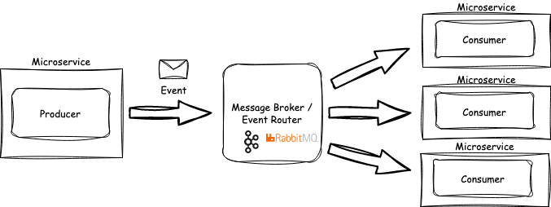
</p>

--

### Benefits of EDA
- Loosely-coupled architecture
- Scalibility of Consumers
- Async processing
- Single Responsibility Principle(SRP) and Open-Closed Principle (OCP).

---

### EDA within Applicaiton

Typical EDA is a distributed system achieved by <span class="highlight"> EXTERNAL</span> events. 

But, how about <span class="highlight">INTERNAL</span> events communication within an application ? 

--

### Scenario
在一個沒有其它微服務的系統架構下，一個單體式的應用服務"訂單系統"，在完成訂單後

- 需要發送信件給客戶
- 並且需要累計銷量供後續管理人員查詢
- And more in the future

--

### Sample Code

```java
@Service
@AllArgsConstructor
public class OrderService {
    private final OrderRepository orderRepository;
    private final NotificationService notificationService;
    private final StatisticsService statisticsService;
    // might dependency more and more ...

    @Transactional
    public void createOrder(Order order) {
        orderRepository.save(order)
        notificationService.sendEmail(order);
        statisticsService.calculateOrderAmount(order);
        // do something in the future
    }
}
```

--

### EDA with Spring Event

<p class="center">
use build-in Spring Event Framework
</p>

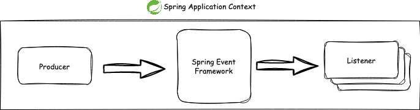

--

### Spring Event Introduction

Spring Event is a standard <span class="highlight">observer design</span> pattern that implements Pub-Sub mechanism in Spring Application. 
A fundamental part of Spring Framework.

By leveraging Spring <span class="highlight"> ***ApplicationEventPublisher*** </span> and <span class="highlight">***@EventListener***</span> and other components to achieve this goal.

--

### Spring Version

- JDK 17
- Springboot 3.2
- Spring Framework 6.1


--

### Use Spring Event Listener (1)

Regular event listener (assume listener has subscribed)

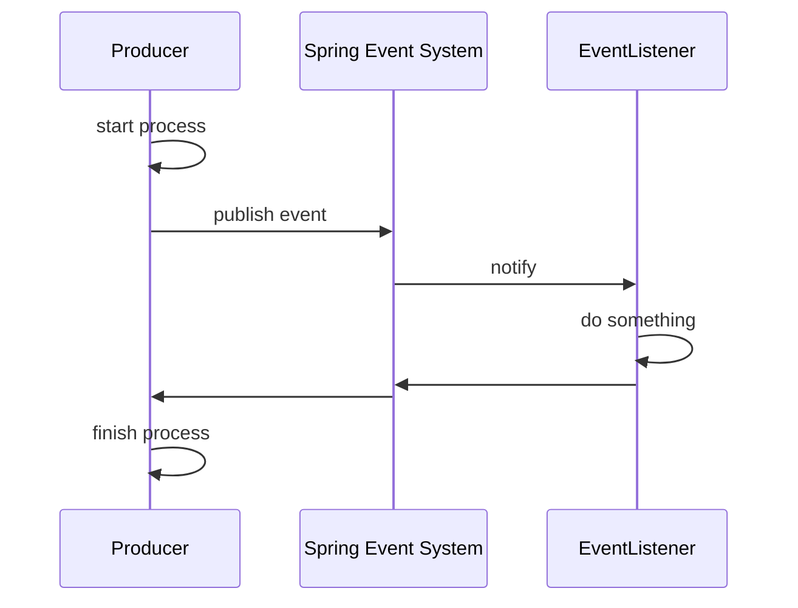

--

### Use Spring Event Listener (2)

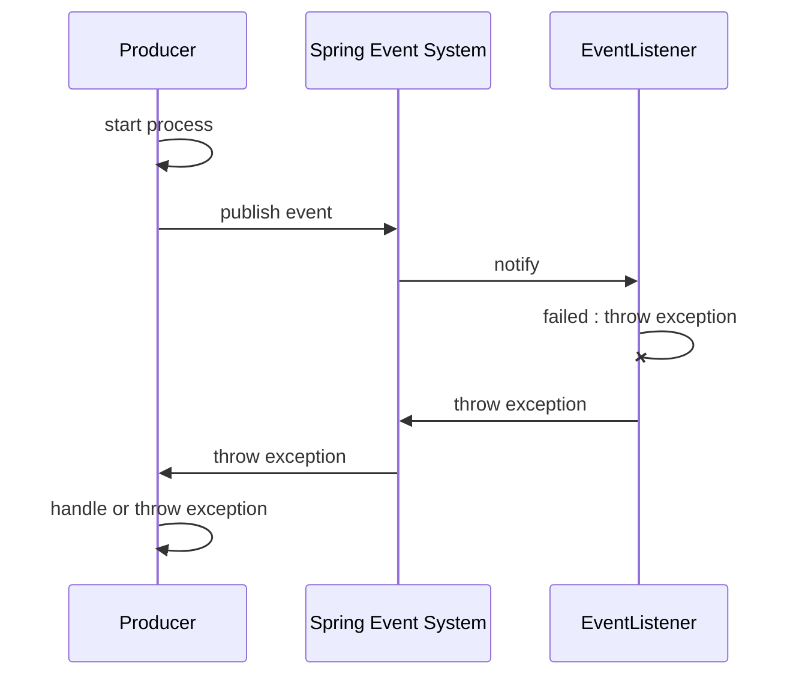


--

### Define your event object
```java
public record OrderCreatedEvent(Order order) {}
```

--

### Publish your event

use ***ApplicationEventPublisher***

```java
@Service
@AllArgsConstructor
public class OrderService {
    private final OrderRepository orderRepository;
    private final ApplicationEventPublisher publisher;

    @Transactional
    public void createOrder(Order order) {
        orderRepository.save(order)

        publisher.publish(new OrderCreatedEvent(order));

        // no need any more
        // notificationService.sendEmail(order);
        // statisticsService.calculateOrderAmount(order);
    }
}
```

--

### Create event listener

use ***@EventListener***

```java
@Component
public class OrderEventListener1 {
    
    @EventListener
    public void receiveAndSendEmail(OrderCreatedEvent event) {
        // send email after receive OrderCreatedEvent
        notificationService.sendEmail(event.getOrder());
    }
}
```

```java
@Component
public class OrderEventListener2 {
    
    @EventListener
    public void receiveAndCalculateAmount(OrderCreatedEvent event) {
        // calculate order amountf
        statisticsService.calculateOrderAmount(event.getOrder());
    }
}
```

--

### Async Event

By default, regular event listener is <span class="highlight">synchronous runs on the same thread with producer</span>. If your operations of a listener take long time, It is better to to use <span class="highlight">asynchronous event listeners</span>.


--

### Async Event

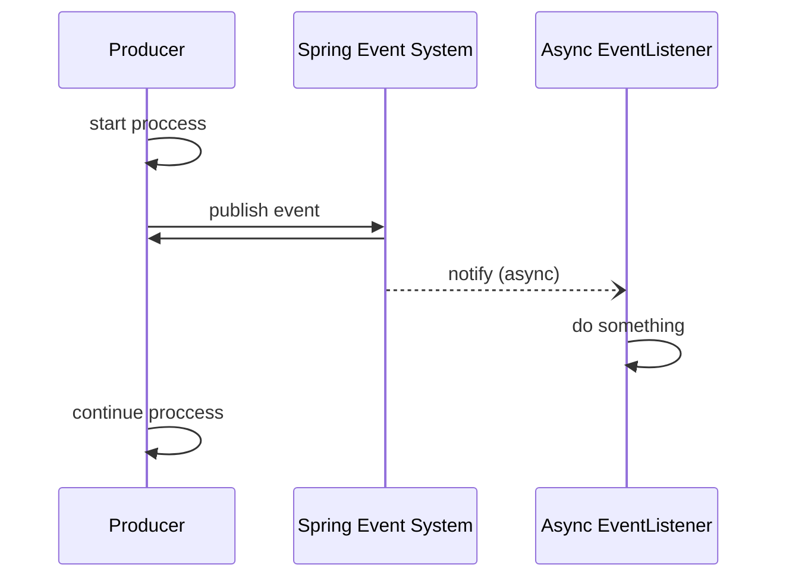

--

### Async Event

use ***@Async***

```java
@Component
public class OrderEventListener {
    
    @Async
    @EventListener
    public void receiveAndSendEmail(OrderCreatedEvent event) {...}

}
```

--

### Event Ordering

How to control the execution order of listeners


--

### Event Ordering

use ***@Order***

```java
@Component
public class OrderEventListener1 {
    
    @EventListener
    @Order(1)
    public void receiveAndSendEmail(OrderCreatedEvent event) {...}

}
```

```java
@Component
public class OrderEventListener2 {
    
    @EventListener
    @Order(2)
    public void receiveAndCalculateAmount(OrderCreatedEvent event) {...}

}
```

--

<p class="center">
DEMO
</p>

---

### Question 1

What if the producer side failed (transaction rollback) but the listener already took action?

--

### Transaction rollback (1)

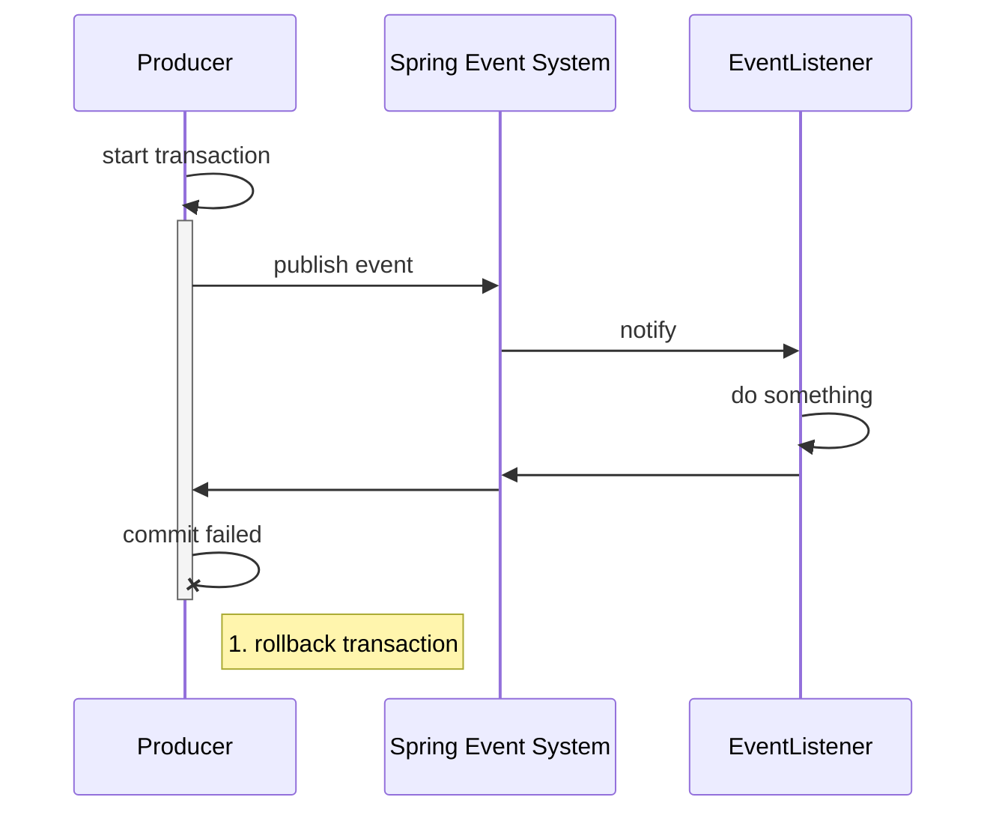

--

### Transaction rollback (2)

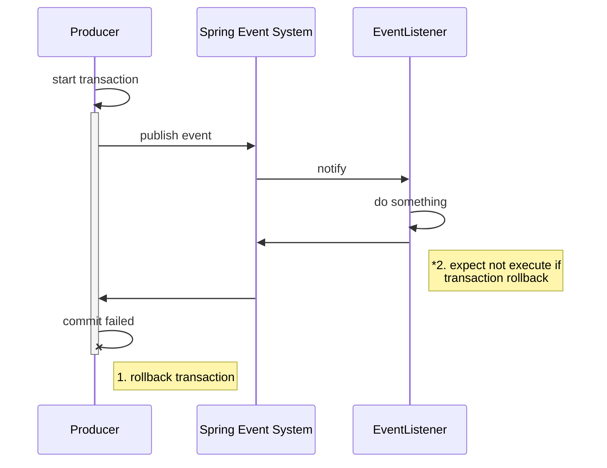

--

### Use Transactional Event Listener

> “ Since Spring 4.2, the listener of an event can be bound to a phase of the transaction. ”

--

### Use Transactional Event Listener

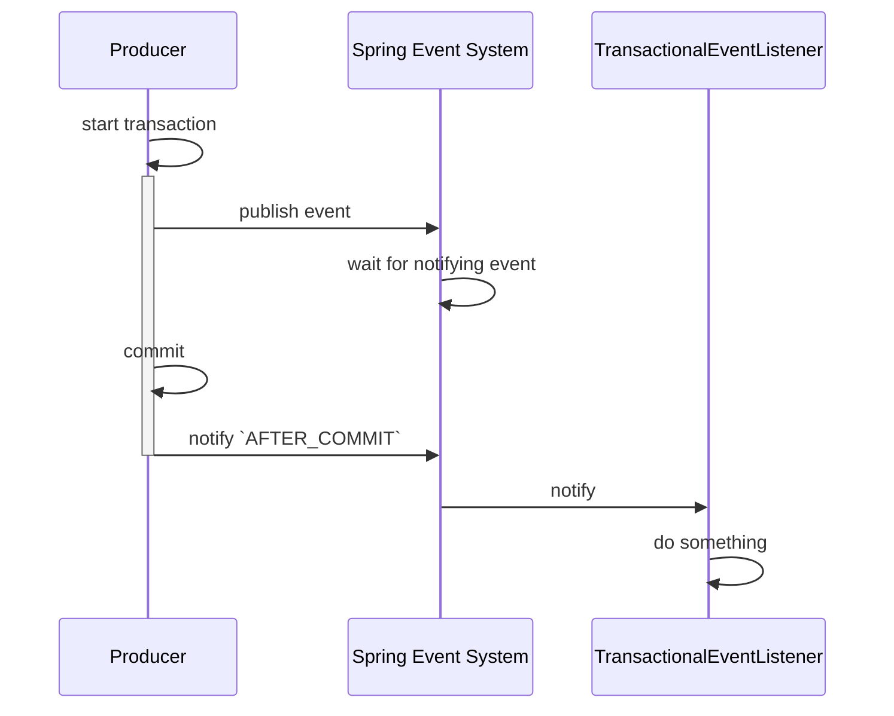

--

### Use Transactional Event Listener 
use ***@TransactionalEventListener*** on listener

```java
@Component
public class OrderEventListener {
    
    @Async   
    // @EventListener
    @TransactionalEventListener
    public void receiveAndSendEmail(OrderCreatedEvent event) {...}

}
```

--

### Transactional Event Phase  

***TransactionalEventListener.TransactionPhase***

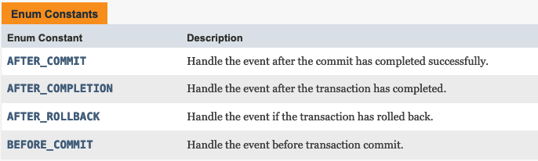

--

### Transactional Event Phase  

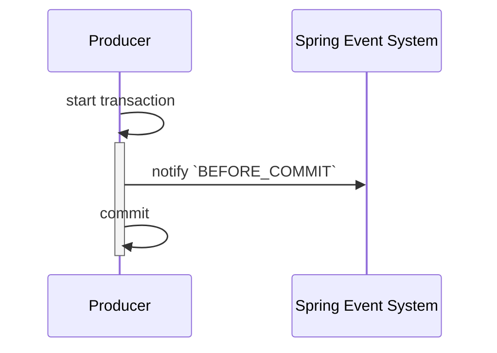

--

### Transactional Event Phase  

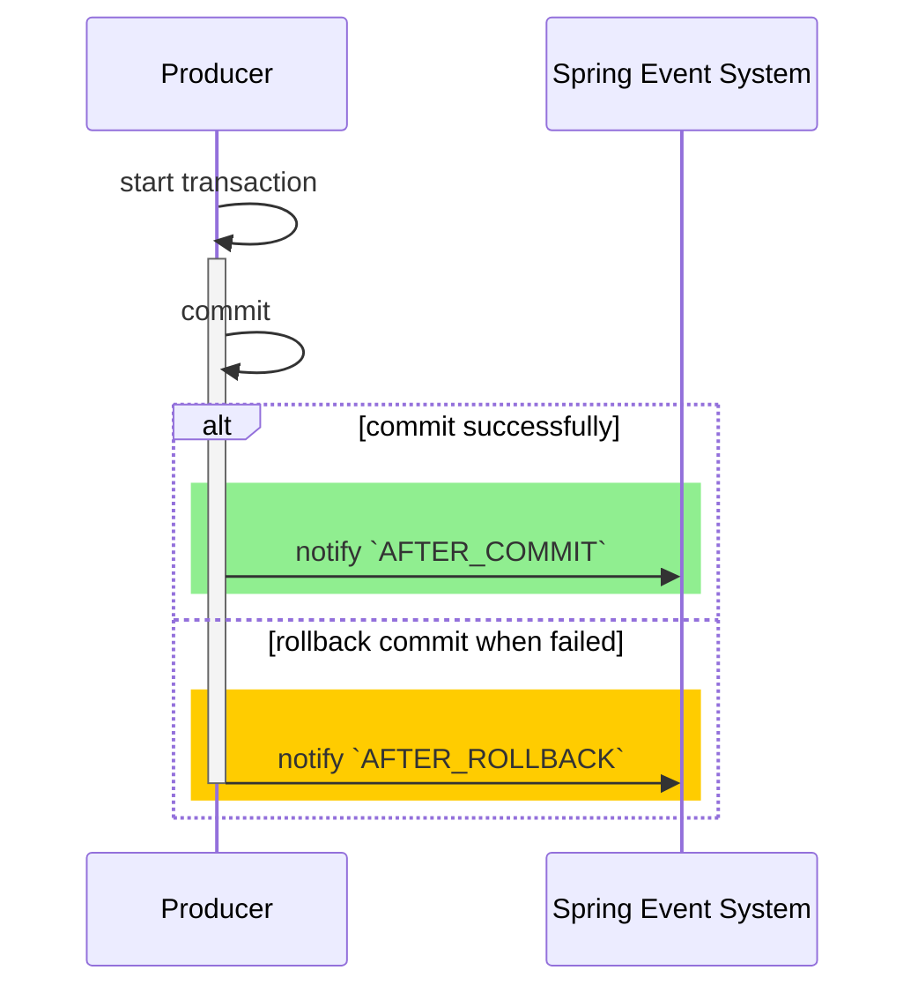

--

### Transactional Event Phase  

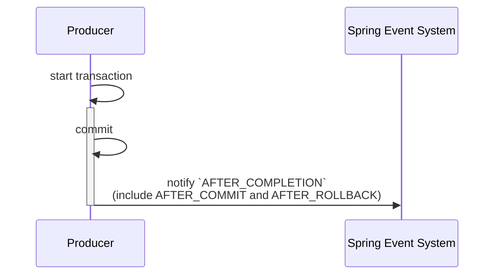

--

<p class="center">
DEMO
</p>

---

### Question 2

What if event listener occurs failure ?

The business logic inside the listener is incompleted, it might cause data inconsistency.

--

### Use Spring Modulith Event

<p class="center">
    Make use of <b>Spring Modulith Event</b>.
</p>

--

### Spring Modulith Introduction (1)

Spring Modulith is an opinionated toolkit to build domain-driven, modular applications with Spring Boot.

<p class="center">
    <b>Modulith = <span class="highlight">Monolithic + Modular Application</span></b>
</p>

--

### Spring Modulith Introduction (2)
Modulize domains within Spring application. 

```bash
Example
└─ src/main/java
   ├─ example
   |  └─ Application.java
   |
   ├─ example.inventory      <-- Inventory Domain
   |  ├─ InventoryManagement.java
   |  └─ SomethingInventoryInternal.java
   |
   ├─ example.order          <-- Order Domain
   |  └─ OrderManagement.java
   └─ example.order.internal
      └─ SomethingOrderInternal.java
```

--

### Spring Modulith Introduction (3)

<p class="center">
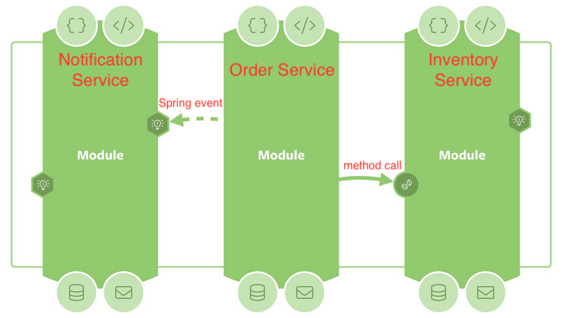
<br>
<span class="cite_source">
source [https://speakerdeck.com/olivergierke/spring-modulith-a-deep-dive] 
</span>
</p>

--

### Spring Modulith Introduction (4)

<p class="center">
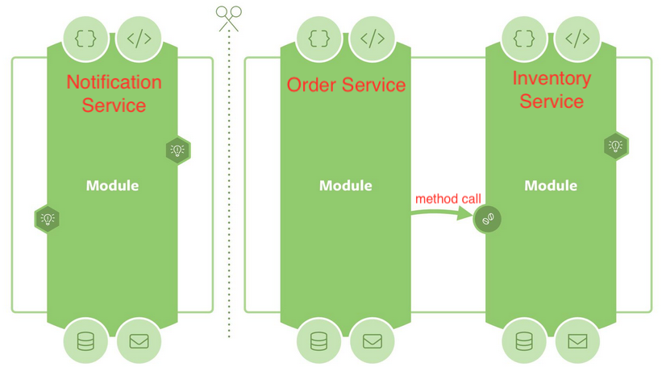
</p>
<span class="cite_source">
source [https://speakerdeck.com/olivergierke/spring-modulith-a-deep-dive] 
</span>
<br>

--

### Spring Modulith Introduction (5)

<p class="center">
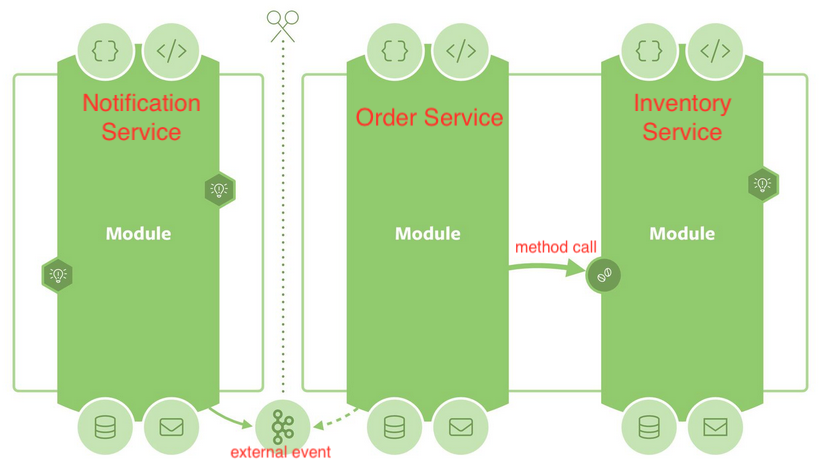
<br>
<span class="cite_source">
source [https://speakerdeck.com/olivergierke/spring-modulith-a-deep-dive] 
</span>
</p>

--

### Spring Modulith Version
<p class="center">
SpringModulith : 1.1.2
</p>

--

### Spring Modulith Event (1)

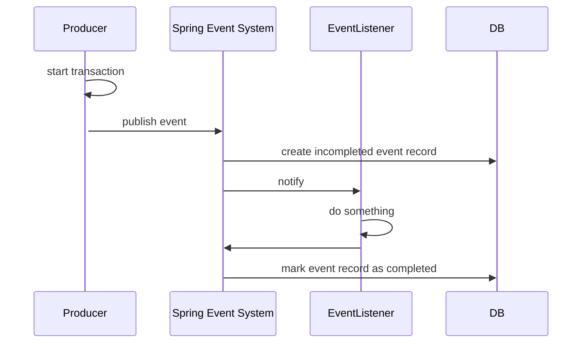

--

### Spring Modulith Event (2)
Event listener occurs failure.

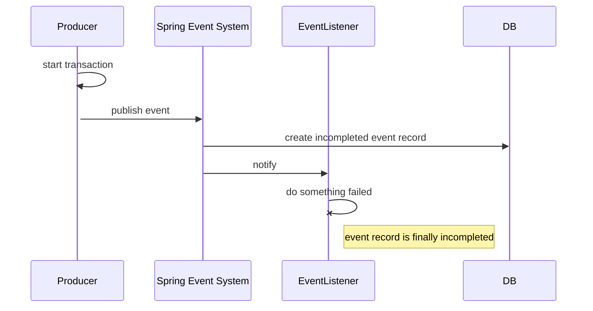

--

### Spring Modulith Event (3)
Republish incompleted event.

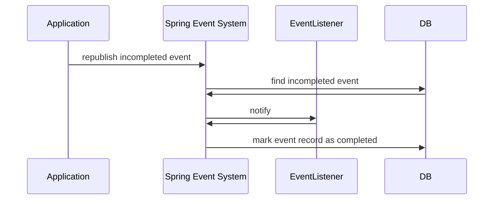

--

### How to use Spring Modulith Event (1)
build.gradle

```groovy
dependencyManagement {
	imports {
		mavenBom "org.springframework.modulith:spring-modulith-bom:1.1.2"
	}
}

dependencies {
	...
  implementation 'org.springframework.modulith:spring-modulith-starter-core'
  implementation 'org.springframework.modulith:spring-modulith-starter-jdbc'
}
```

--

### How to use Spring Modulith Event (2)
application.yml


```yaml
spring:
  modulith:
    // republish incompleted event when application restart
    republish-outstanding-events-on-restart: true
    events:
      jdbc:
        schema-initialization:
         enabled: true  // initialize event table
```

--

### How to use Spring Modulith Event (3)

Use ***@ApplicationModuleListener*** instead to simplify the annotation.
```java
@TransactionalEventListener
@Transactional(propagation = Propagation.REQUIRES_NEW)
@Async
public void receiveAndSendEmail(OrderCreatedEvent event) {...}

}
```
Change to 
```java
@ApplicationModuleListener
public void receiveAndSendEmail(OrderCreatedEvent event) {...}

```

--

<p class="center">
DEMO
</p>

---

### Question 3 

How to integrate with external brokers such as KafKa, RabbitMQ from internal Spring events.

--

### Scenario (Original)
在一個沒有其它微服務的系統架構下，一個單體式的應用服務"訂單系統"，在完成訂單後

- 需要發送信件給客戶
- 並且需要累計銷量供後續管理人員查詢

--

### Scenario (New)
組織內開發了一個以基於RabbitMQ為架構的發送信件微服務，
原本的"訂單系統"，在完成訂單後

- ~~需要發送信件給客戶~~ <span class="highlight">發送訂單事件到RabbitMQ，由信件微服務消費發送信件給客戶</span>
- 並且需要累計銷量供後續管理人員查詢

--

### Integrate with external brokers (1)
Approach 1 : Implement sending event in event listener

```java
@Component
@RequiredArgsConstructor
public class OrderEventListener1 {

    private final RabbitTemplate rt;

    @ApplicationModuleListener
    public void receiveAndSendEmail(OrderCreatedEvent event) {

        rt.convertAndSend("exchange.key", "routing.key", event);
    
    }
```

--

### Integrate with external brokers (2)
Approach 2 : use <span class="highlight">Spring Modulith Externalizing Events</span>. Now it supports external borkers ***Kafka, AMQP, JMS, SQS, SNS (Redis is possible in the future)***.

--

### Externalizing Events (1)
Scenario : use RabbitMQ as message borker.

bulid.gradle
```groovy
dependencies {
    ...
    implementation 'org.springframework.modulith:spring-modulith-events-api'
    // here we use RabbitMQ as message borker
    implementation 'org.springframework.modulith:spring-modulith-events-amqp'
}
```

--

### Externalizing Events (2)
Enable externalizing events

application.yml

```yaml

spring:
  modulith:
    republish-outstanding-events-on-restart: true
    events:
      jdbc:
        schema-initialization:
         enabled: true 
        externalization:
         enabled: true    // Enable externalizing events
 

```

--

### Externalizing Events (3)

use ***@Externalized*** on your event object
```javascript
// expression in RabbitMQ
@Externalized("{exchange name}::{routing key}")

// expression in Kafka
@Externalized("{topic name}::{partition key}")
```

--

### Externalizing Events (3)

For Example

RabbitMQ exchange name : `order.created`
```java
@Externalized("order.created")
public record OrderCreatedEvent(Order order) {}
```

--

<p class="center">
DEMO
</p>

---

### Consumer of Microservices

We can still leverage Spring Modulith Event features such as persistent event table and resubmit(replay) events if failed in consumers of microservices.

--

### Consumer of Microservices

Receive event from RabbitMQ then send to Spring Event, then 
handle event in Spring Event Listener.
```java
@Component
@RequiredArgsConstructor
public class RabbitmqListener {
    private final ApplicationEventPublisher applicationEventPublisher;

    @RabbitListener(queues = "order.queue")
    public void receiveEvent(OrderCreatedEvent event) {
        applicationEventPublisher.publishEvent(event);
    }

}
```

--

### Consumer of Microservices

If we have to use or change another external broker like Kafka, just adjust the consumer class, the Spring Event Listener do not change anything.

```java
@Component
@RequiredArgsConstructor
public class KafkaListener {
    private final ApplicationEventPublisher applicationEventPublisher;

    @KafkaListener(topics = "topicName", groupId = "foo")
    public void listenGroupFoo(OrderCreatedEvent event) {
        applicationEventPublisher.publishEvent(event);
    }

}
```

--

### Consumer of Microservices
Also easily to do unit test.

```java
@SpringBootTest
class SpringEventTest {
    @Autowired
    private ApplicationEventPublisher applicationEventPublisher;
    @MockBean
    private OrderEventListener1 eventListener1;

    @Test
    void sendOrderCreatedEvent() {
        // When
        applicationEventPublisher.publishEvent(new OrderCreatedEvent(generateOrder()));

        // Assert
        verify(eventListener1, times(1)).receiveAndSendEmail(any());
    }
}
```


---

### Other Topics
- Idempotent Processing (Idempotent Key)
- Spring Event Performance (see listeners' workload)
- Documentation (e.g. Springwolf)
- How to find/define event (e.g. DDD Event Storming)

---

### Recap

- ***@EventListener*** : regular event listener. run within a single thread of producer's process.
- ***@TransactionalEventListener*** : transaction-bound events listener. run according to transactional phase.
- ***@Async*** : run parallel.
- ***@Order*** : control execution order of listeners.

--

### Recap

- ***@ApplicationModuleListener*** : to simplify listener annotation. (<span class="highlight">*Recommend</span>).
- ***@Externalized*** : enable externalize events.

---

### References

- ##### [ A Deep Dive into Spring Application Events](https://www.youtube.com/watch?v=4oBqCtdRIYo)
- ###### [Mastering Events in Spring Boot: A Comprehensive Guide](https://medium.com/hprog99/mastering-events-in-spring-boot-a-comprehensive-guide-86348f968fc6) 
- ###### [Spring Modulith / Working with Application Events](https://docs.spring.io/spring-modulith/reference/events.html)

- #### [Transaction-bound Events](https://docs.spring.io/spring-framework/reference/data-access/transaction/event.html)


---

## Thank You